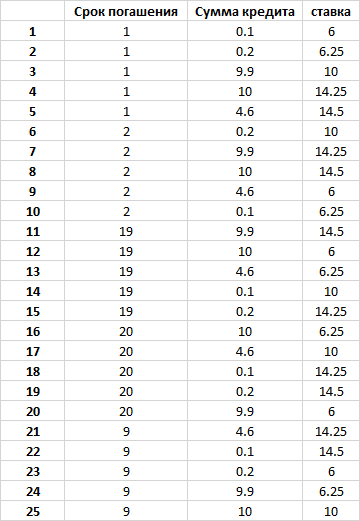

# Тестовая документация для проверки расчета сервиса по выдаче кредитов
 + [Замечания к документации/заданию](#notes)
 + [Ограничения](#boundaries)
 + [Критерии приемки](#criteria)
 + [Чек-лист](#checklist)
 + [Тест-кейсы](#tests)

##  Замечания к документации/заданию

- Единица измерения финансов. Предлагаю рассмотреть возможность замены миллионов на тысячи. Исходя
- Возраст. Несовершеннолетние тоже могут брать кредит? Рекомендую рассмотреть вопрос об ограничении возраста с 16(18) до 60/65
- Доход и запрашиваемая сумма указана в миллионах. Рекомендую рассмотреть вопрос об измнении на тысячи. При тестировании буду исходить, что шаг 0.1
- Срок погашения указан в годах. Рекомендую рассмотреть возможность изменения на месяцы. При тестировании буду исходить из того, что кредит можно взять на опредленное количество полных лет
- Нет информации об изменении/сохранении модифкатора при цели "Автокредит"

##  Ограничения
- Несмотря на то, что сейчас мы можем тестировать кредитный калькулятор, отправляя запросы через API, я ограничился именно проверкой самой бизнес-логики
    - Корректен ли расчет
    - Одобрен/ Не одобрен кредит
  
- Не проводим специфичные для API тесты с изменением методов запроса, дублированием/отстутствием параметров итд
- Для того чтобы остаться в рамках выполнения тестового задания, допускаю, что параметры "пол", "источник дохода", "кредитный рейтинг", "срок погашения", "цель" можно выбрать только из списка предложенных значений. 
Значения, выходящие за допустимые, негативные варианты в данной тестовой модели не учитываю

##  Критерии приемки
- ### [01] Допустимые значения входных параметров
    - [01.1] Возраст [not negative int], лет
    - [01.2] Пол [F, M] [female,male]
    - [01.3] Источник дохода [пассивный доход, наёмный работник, собственный бизнес, безработный] [passive income, employee, own business, unemployed]
    - [01.4] Доход за последний год [int], млн
    - [01.5] Кредитный рейтинг [-2, -1, 0, 1, 2]
    - [01.6] Запрошенная сумма [0.1 .. 10], млн
    - [01.7] Срок погашения [1..20], лет
    - [01.8] Цель [ипотека, развитие бизнеса, автокредит, потребительский] [mortgage, business development, car loan, personal loan]
    
- ### [02]Условия выдачи кредита
    - [02.1] Если возраст превышает пенсионный возраст на момент возврата кредита, кредит не выдаётся
    - [02.2] Если результат деления запрошенной суммы на срок погашения в годах более трети годового дохода, кредит не выдаётся
    - [02.3] Если кредитный рейтинг -2, кредит не выдаётся
    - [02.4] Если в источнике дохода указано "безработный", кредит не выдаётся
    - [02.5] Если годовой платёж (включая проценты) больше половины дохода, кредит не выдаётся
    
- ### [03] Рассчет суммы кредита
    - [03.1] Если работают несколько условий по сумме кредита - выбирается наименьшая
    - [03.2] При пассивном доходе выдаётся кредит на сумму до 1 млн, наёмным работникам - до 5 млн, собственное дело - до 10 млн
    - [03.3] При кредитном рейтинге -1 выдаётся кредит на сумму до 1 млн, при 0 - до 5 млн, при 1 или 2 - до 10 млн
    
- ### [04]Условия изменения базовой ставки
  - [04.1] Все модификаторы процентной ставки суммируются, применяется итоговый модификатор
  - #### по параметру "Цель"
    - [04.2.1] ипотека (-2%)
    - [04.2.2] развития бизнеса (-0.5%)
    - [04.2.3] потребительский кредит (+1.5%)
    
  - #### по параметру "Кредитный рейтинг"
    - [04.3.1] +1.5% для кредитного рейтинга  -1
    - [04.3.2] 0% для кредитного рейтинга 0
    - [04.3.3] -0.25% для кредитного рейтинга 1
    - [04.3.4] -0.75% для кредитного рейтинга 2

  - #### по параметру "Источник дохода"
    - [04.4.1] Для пассивного дохода ставка повышается на 0.5%
    - [04.4.2] для наемных работников ставка снижается на 0.25% 
    - [04.4.3] с собственным бизнесом ставка повышается на 0.25%
    
  - #### по параметру "Запрашиваемая сумма"
    - [04.5.1] Модификатор в зависимости от запрошенной суммы рассчитывается по формуле `[-log(sum)]
    
- ### [05] Способ расчета годового платежа
    - [05.1] Базовая ставка - 10%
    
    - [05.2] Годовой платеж по кредиту определяется по следующей формуле:

`(<сумма кредита> * (1 + <срок погашения> * (<базовая ставка> + <модификаторы>))) / <срок погашения>`
- ### [06] Выходные данные после рассмотрения заявки
    - [06.1] Кредит выдаётся/не выдаётся
    - [06.2] Годовой платеж по кредиту

##  Чек-лист
- ### валидация по значениям входных параметров
    - [01.1] возраст [-20, -1, 0, 1, 40, 100]
    - [01.2] пол (исхожу из того, что нельзя выбрать невалидное значение)
    - [01.3] источник дохода (исхожу из того, что нельзя выбрать невалидное значение)
    - [01.4] Доход за последний год [-1, 0, 1, 0.3, 5.6, 9.9, 10, 11.1] 
    - [01.5] Кредитный рейтинг [-2, -1, 0, 1, 2] (исхожу из того, что нельзя выбрать невалидное значение, не беру -3, 0.5 , null итд)
    - [01.6] Запрошенная сумма [-0.5 -0.1, 0, 0.1, 1, 9.9 10, 10.1], млн
    - [01.7] Срок погашения [0, 1, 10, 19,20], лет (исхожу из того, что нельзя выбрать невалидное значение, можно выбрать только значение из списка)
    - [01.8] Цель [mortgage, business development, car loan, personal loan] (исхожу из того, что нельзя выбрать невалидное значение)
    
- ### валидация по условиям выдачи кредита
    - [02.1] Если возраст превышает пенсионный возраст на момент возврата кредита, кредит не выдаётся 
      [мужчина, возраст + срок погашения = 59,60,61, 64, 65, 66; женщина, возраст + срок погашения 50, 59, 60, 61, 70]
    - [02.2] Если результат деления запрошенной суммы на срок погашения в годах более трети годового дохода, кредит не выдаётся
      [(запрошенная сумма + срок) >,>=, < (доход/3)]
    - [02.3] Если кредитный рейтинг -2, кредит не выдаётся
    - [02.4] Если в источнике дохода указано "безработный", кредит не выдаётся
    - [02.5] Если годовой платёж (включая проценты) больше половины дохода, кредит не выдаётся
    
- ### проверка рассчета суммы кредита
    - [03.1] Если работают несколько условий по сумме кредита - выбирается наименьшая
    - [03.2] [пассивный доход, сумма - 0.1, 0.9 ,1, 1.1], [наемный работник, сумма - 0.8, 4.9,5, 5.1], [свое дело, ]
    - [03.3] [рейтинг -1, сумма - 0.1, 0.9 ,1, 1.1], [рейтинг 0, сумма - 0.8, 4.9,5, 5.1], [рейтинг 1, рейтинг 2, сумма - 5.5, 9.9,10, 10.1]

- ### [04]Условия изменения базовой ставки
  #### Изменение базовой ставки не возвращается потребителю, поэтому проверяется на уровне юнит-тестов
  - [04.1] Проверка, что все модификаторы суммируются
  - #### по параметру "Цель"
    - [04.2.1] ипотека (-2%)
    - [04.2.2] развития бизнеса (-0.5%)
    - [04.2.3] потребительский кредит (+1.5%)
    
  - #### по параметру "Кредитный рейтинг"
    - [04.3.1] +1.5% для кредитного рейтинга  -1
    - [04.3.2] 0% для кредитного рейтинга 0
    - [04.3.3] -0.25% для кредитного рейтинга 1
    - [04.3.4] -0.75% для кредитного рейтинга 2

  - #### по параметру "Источник дохода"
    - [04.4.1] Для пассивного дохода ставка повышается на 0.5%
    - [04.4.2] для наемных работников ставка снижается на 0.25% 
    - [04.4.3] с собственным бизнесом ставка повышается на 0.25%
    
  - #### по параметру "Запрашиваемая сумма"
    - [04.5.1] Модификатор в зависимости от запрошенной суммы рассчитывается по формуле `[-log(sum)]
    
- ### [05] Способ расчета годового платежа
    - [05.1] Узнать, где отображается - в коде или в переменных окружения - базовая ставка
    - [05.2] Проверить расчет по формуле:
`(<сумма кредита> * (1 + <срок погашения> * (<базовая ставка> + <модификаторы>))) / <срок погашения>`
      
      
      

       
